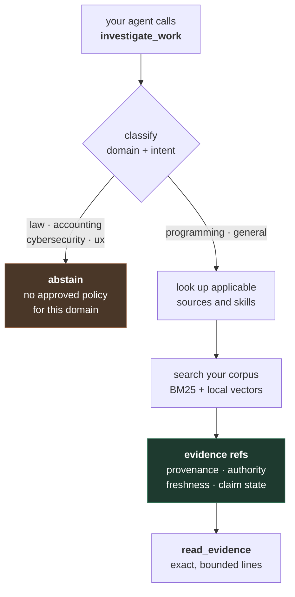

# Cerebro

**Point it at your repo. Your agent learns why the code is the way it is — with the commit that proves it and the date it was decided.**

An MCP server that lets an agent consult your knowledge without letting your knowledge instruct the agent.

---

## The problem I kept hitting

My agent would tell me, with total confidence, something my project had decided against two years earlier.

Not because it was stupid. Because nothing in the loop knew the difference between *a note I wrote in 2023* and *the decision that replaced it*, or between *the official spec* and *a draft I abandoned*. Similarity search treats them the same: same words, same score.

Three things go wrong, every time:

**Anything retrieved becomes an instruction.** A note saying "always deploy straight to prod" is text an agent may simply obey. Nothing distinguishes *this is evidence you should weigh* from *this is an order*. Whoever can write one file into your corpus inherits your agent.

**Similarity is not authority.** A four-year-old draft and a normative specification score identically if the words match. Nothing records that one supersedes the other, or that one expired.

**Silence looks exactly like ignorance.** Ask about something the system knows nothing about and you get the closest-looking passages anyway, with the same confidence as a real answer.

## What Cerebro does instead

It answers one question deterministically: *given this task, what do I actually know that bears on it, and how far can I be trusted about it?*



That abstain branch is not a failure path. **It is the feature.** Cerebro would rather tell your agent *"I have no approved policy for employment law, I am not answering this"* than hand it the nearest-looking paragraph.

## Try it on your own repo, in three commands

Your reasoning already exists. It is in the commit messages that explain **why**, written by the person deciding at the moment of deciding.

```bash
# 1. turn your history into a corpus (reads only; writes nothing to your repo)
python scripts/git_corpus.py --repo . --out ./corpus

# 2. index it
cerebro-mcp index --corpus-root ./corpus --policy ./policy.yaml

# 3. wire it into your client
cerebro-mcp init
```

A minimal `policy.yaml`:

```yaml
version: 1
include: ['**']
exclude: ['private/**']
```

> Only Markdown is ever considered, so `include` picks *which* files, not which types. Sharp edge worth knowing: `'**/*.md'` matches only files inside a subdirectory and silently skips everything at the top level. Use `'**'`.

Now ask your agent *"why did we choose X?"* and it gets the commit, the date and the reasoning — instead of an invention.

## What I measured

I do not want you to take my word for any of this, so here are the numbers, including the bad one.

Twelve "why was this decided" questions against this repository's own history — 76 commits carrying real reasoning, 152 passages. Ground truth is known because I wrote those commits deliberately.

| question language | recall@3 | recall@10 | MRR@10 |
|---|---|---|---|
| English — matches the corpus | **75%** | 92% | 0.73 |
| Spanish — corpus is 95% English | **25%** | 92% | 0.29 |

`recall@10` is identical, so **the right document is always retrieved — the entire gap is ranking.** Cross-lingual retrieval costs two thirds of the top-3 precision, and that matters because "Spanish-speaking dev writing English commits" is the common case, not an edge one. It is the next piece of work, and it now has a number to beat instead of an impression to argue about.

The eval lives in [`evals/project-memory/`](evals/project-memory/) so you can reproduce it, or beat it.

## What makes it different

**Selection is deterministic, not modelled.** Which sources apply is boolean set membership over a signed registry — no scoring, no embedding, no model in the decision path. Corpus content cannot influence *what gets selected*, only what comes back as evidence. That property is structural, not a policy someone remembers to enforce.

**Evidence is never instruction.** The separation is a normative requirement, not a convention. Retrieved text is disclosed as untrusted evidence with its provenance attached.

**Everything is read-only.** The MCP surface is exactly two tools and neither writes anything. All mutation — indexing, approval, activation — lives in a CLI a human runs.

**Claims carry state.** Each one is explicitly supported, stale, expired, or of unknown provenance. *"I found something"* and *"I found something current and authoritative"* are different answers, and Cerebro tells you which one you got.

## The skills layer

Instead of flooding your agent's context with every skill you own, Cerebro dispatches the ones that apply — and discloses what permissions each one declares.


Six skills ship and are active on install — running falsifiability probes, verifying claims before asserting them, making invalid states inexpressible, refactoring without touching a test file, sweeping the clock to find time bombs, and reading your own interface as a stranger.

Every one of them was used to build this project and **found real defects while doing it**: two expiry time bombs that would have stopped the server on a fixed date, a security hole in a control-character check, and a complete, fully tested feature that no agent could reach.

Your own skills live alongside them, stay local, and are never redistributed.

## Trust model

Cerebro assumes the corpus may be hostile.

- **Provenance is attribution, not safety.** A valid signature establishes *who* published a pack. It is never evidence the content is correct or safe, and the code says so at the point where it verifies signatures.
- **Default-deny by absence.** Permission envelopes start empty and "allow everything" is *not expressible* — no wildcard exists in the host or path grammars, so a broad grant cannot be written even by a correctly signed pack.
- **Human approval is bound to a content digest.** Edit approved content and the approval stops matching; activation fails rather than carrying it forward.
- **Natural-language analysis is not a safety guarantee** and is never presented as one. Whether prose persuades an agent to do something harmful is not observable by inspection. The real mitigations are the permission envelope and the host's own enforcement.

## Status — read this before installing

Honest state as of 2026-07-25.

**Working and tested** — 867 tests
- Hybrid retrieval (BM25 + local vectors via `sqlite-vec`) over your corpus
- The two-tool MCP contract, structured output, typed failures
- Signed policy packs with Ed25519 manifests and fail-closed loading
- Domain-gated discovery with explicit abstention
- Atomic index and skill-set build / promote / rollback
- The full skill lifecycle from the terminal

**Limits, stated rather than buried**
- Cross-lingual retrieval rates a third of same-language. Measured above.
- Six bundled skills is a starting point, not a library. The mechanism is finished; the content is deliberately small.
- The dispatch ceiling is five refs and six skills ship, so one is reported as a gap. The ceiling was *not* raised to fit the pack — six refs measured 6.6 KB, a third of the default output budget. The cut is alphabetical: deterministic and non-injectable by design, but unrelated to relevance. Making it operator-configurable is the obvious next step.
- Skill dispatch requires the client to send `host_skills`. Omitting it returns a byte-identical pre-skills response — intentional, but the layer stays invisible until a client opts in.
- Only macOS/POSIX is validated. `index.py` uses POSIX-only primitives and will not import on Windows.
- Live web research exists but is **deliberately inert**: it needs an operator-defined allowlist that does not ship by default. The absence is a posture, not an oversight.
- There is no generative model anywhere in this project. Cerebro retrieves, classifies and discloses. It does not write prose.

## Install

Requires **Python 3.12** on macOS or Linux. Not 3.13 — the project pins `>=3.12,<3.13` because the embedding runtime is validated against exactly that version.

```bash
uv sync
uv run cerebro-mcp doctor   # read-only health check, safe at any time
uv run cerebro-mcp serve    # the MCP server, over stdio
```

## Design notes

[`openspec/`](../openspec/) carries the specifications, the architecture decisions and a per-unit implementation record — including what was rejected and why. If you want to understand a decision rather than read the code, start there.

Every unit shipped with a **falsifiability probe**: the invariant just written was broken on purpose and the suite re-run to confirm the right tests failed. Roughly one probe in three found something. One of them removed a guard and *wrote a live private key into the package directory* instead of merely failing an assertion — which is how I know that guard was the only thing standing there.

## Licence

Apache 2.0. See [`LICENSE`](LICENSE) and [`NOTICE`](NOTICE).

Chosen over MIT for the explicit patent grant: a project whose whole argument is about trust boundaries should not leave a patent question open. Chosen over AGPL because the goal is adoption, and a copyleft reaching across a network would keep exactly the people this is built for from trying it.
